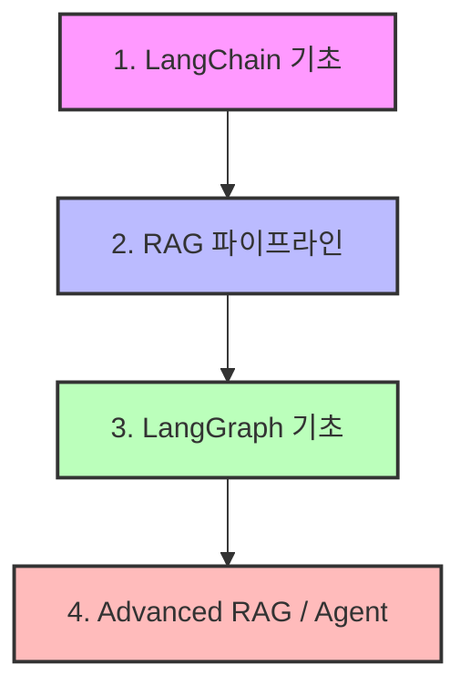
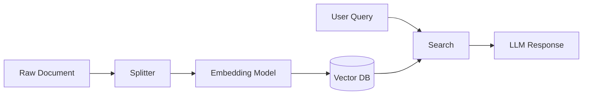
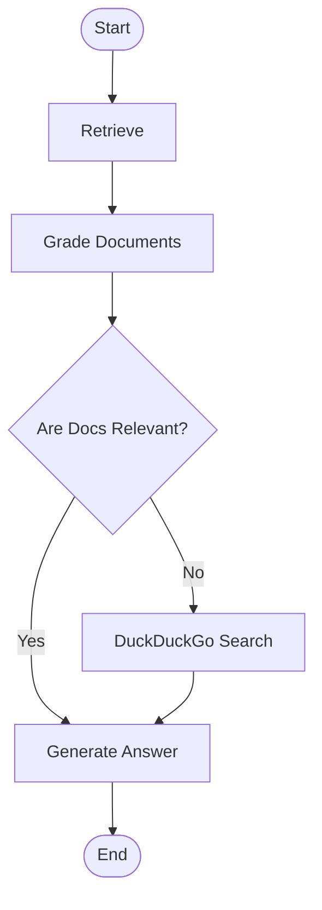

# LangChain & LangGraph 학습 가이드 🚀

이 가이드는 **LangChain**과 **LangGraph**를 처음부터 체계적으로 학습하기 위해 마련되었습니다. LLM 기반의 애플리케이션 개발부터, 에이전트와 워크플로우를 직접 제어하는 그래프 기반 구조까지 단계별로 이해하고 실습할 수 있도록 설계했습니다.

---

## 🗺️ 학습 로드맵 개요

LangChain과 LangGraph는 LLM을 활용한 애플리케이션을 빌드할 때 서로 보완 관계에 있습니다.

1. **LangChain 기초 (Basics)**:
   * prompt, model, output parser를 연결하는 **LCEL(LangChain Expression Language)** 구조 이해.
2. **RAG 파이프라인 (Retrieval-Augmented Generation)**:
   * 문서 로드 -> 청킹(Text Splitting) -> 임베딩 -> 벡터DB 저장 및 검색 -> 답변 생성의 흐름 학습.
3. **LangGraph 기초 (Graph & State)**:
   * 상태(State)를 가진 노드(Node)와 엣지(Edge)로 순환(Cyclic) 워크플로우 구현법 학습.
4. **Advanced RAG (Corrective/Self-RAG)**:
   * 검색 결과의 적합성을 스스로 평가하고, 필요 시 웹 검색으로 보완하여 답변을 교정하는 고급 그래프 워크플로우 구현.

---

## 🛠️ 실습 환경 준비

작업 디렉토리에 필요한 라이브러리들을 설치해 두었습니다. 가상환경(`.venv`) 내에서 아래 튜토리얼 스크립트들을 순서대로 실행해 볼 수 있습니다.

### 핵심 설치 라이브러리
* `langchain`: 기본 컴포넌트 프레임워크
* `langchain-community`: 커뮤니티 개발 도구 및 통합 (DuckDuckGo 검색 등)
* `langgraph`: 에이전트 워크플로우 제어를 위한 그래프 라이브러리
* `langchain-chroma` & `sentence-transformers`: 벡터 데이터베이스 및 오픈소스 임베딩
* `langchain-huggingface`: Hugging Face 모델 활용을 위한 어댑터

> [!NOTE]
> `.env` 파일에 이미 `HUGGINGFACEHUB_API_TOKEN`과 `LANGSMITH_API_KEY`가 설정되어 있으므로, 추가적인 복잡한 설정 없이 바로 API를 사용해 추론이 가능합니다.

---

## 📚 1단계: LangChain 기초 (`01_langchain_basics.py`)

LangChain의 핵심은 **LCEL(LangChain Expression Language)**입니다. 이전의 복잡한 체인 선언 방식 대신 `|` (파이프) 연산자를 사용하여 데이터를 직관적으로 흐르게 만듭니다.

### 주요 개념
* **PromptTemplate**: LLM에 들어갈 입력을 구조화합니다.
* **ChatModel (HuggingFaceEndpoint)**: 모델 API와 연동하여 출력을 얻습니다.
* **StrOutputParser**: 모델의 응답(AIMessage)에서 텍스트 콘텐츠만 깔끔하게 추출합니다.

---

## 🔍 2단계: RAG 기초 (`02_rag_basics.py`)

외부 지식 기반을 활용해 답변의 품질을 높이고 환각(Hallucination) 현상을 방지하는 기술입니다.

### 주요 개념
* **RecursiveCharacterTextSplitter**: 긴 글을 의미 있는 크기로 나눕니다.
* **Chroma**: 로컬에 벡터 데이터를 저장하는 가벼운 임베딩 데이터베이스입니다.
* **Retriever**: 벡터 스토어에서 사용자의 쿼리와 가장 유사도가 높은 청크(Chunk)들을 찾아 LLM에 프롬프트 컨텍스트로 전달합니다.

---

## 🕸️ 3단계: LangGraph 기초 (`03_langgraph_basics.py`)

단순히 `A -> B -> C` 형식으로 실행되는 단방향 체인은 예외 처리나 루프(재시도)를 구현하기 어렵습니다. LangGraph는 **상태 머신(State Machine)** 구조를 도입하여 이를 극복합니다.

### 3대 핵심 요소
1. **State**: 그래프 내의 모든 노드가 공유하고 수정할 수 있는 상태 데이터입니다. (주로 메시지 목록 등)
2. **Nodes**: 특정 비즈니스 로직을 수행하고 State를 업데이트하는 파이썬 함수입니다.
3. **Edges**: 노드 간의 흐름을 정의합니다. 조건부 에지(Conditional Edge)를 사용하여 다음 노드를 다이내믹하게 결정할 수 있습니다.

---

## 🧠 4단계: LangGraph Advanced RAG (`04_advanced_rag_graph.py`)

단순 RAG는 검색 결과가 쿼리와 관련이 없거나 검색 실패가 일어나도 LLM이 억지로 답변을 꾸며내어 환각을 일으킵니다. 이를 보완하는 **Corrective RAG (CRAG)** 패턴을 LangGraph로 작성해 봅니다.

### 동작 과정
1. **Retrieve**: 벡터 데이터베이스에서 관련 문서를 검색합니다.
2. **Grade Documents**: 검색된 문서가 사용자의 질문과 실질적으로 관련이 있는지 채점합니다.
3. **Decide**: 문서가 쓸모 있다면 답변 생성 단계(`generate`)로 바로 가고, 쓸모 없다면 검색 품질 보완을 위해 웹 검색(`web_search`) 노드를 거친 후 답변을 생성합니다.

---

## 🎯 다음 학습 과제
실습 소스코드를 모두 돌려보고 이해했다면, 다음과 같은 확장을 시도해 보세요.
1. **Self-RAG 구현**: 생성된 답변에 환각이 없는지(Hallucination grader)와 질문에 정말 제대로 답했는지(Answer grader)를 검증하는 노드 추가하기.
2. **대화형 메모리**: `SqliteSaver`를 그래프에 컴파일하여 대화 이력(State)이 세션별로 유지되는 챗봇 구성하기.
3. **LangSmith로 디버깅**: 현재 프로젝트에 연동된 LangSmith 콘솔에서 실행 트레이스(Trace)를 확인하며 토큰 소모량과 노드 흐름 눈으로 직접 보기.

각 튜토리얼 코드는 `tutorials/` 폴더에 생성되어 있으니, 터미널에서 `python tutorials/01_langchain_basics.py` 와 같이 하나씩 실행해 보며 동작을 느껴보세요!
